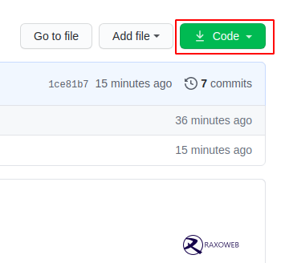
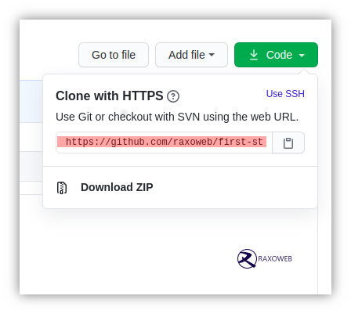

[](https://github.com/raxoweb-first-step/)
[](https://www.raxoweb.com)
[](https://opensource.org/licenses/MIT)


# First Step To Improve Your Coding Skills

It's hard. It's always hard the first time you do something. Especially when you are collaborating, making mistakes isn't a comfortable thing. We wanted to simplify the way new coder collaborate for the first time with this community.

Reading articles & watching tutorials can help, but what's better than actually doing the stuff in a practice environment? This project aims at providing guidance & simplifying the way beginners make their first commit. If you are looking to make your first collaboration, follow the steps below.


#### *You need git installed in your PC/Laptop*

#### [Install GIT](https://git-scm.com/)

## Fork this repository


Fork this repository by clicking on the fork button on the top of this page.
This will create a copy of this repository in your account.

## Clone the repository



Now clone the forked repository to your machine. Go to your GitHub account, open the forked repository, click on the clone button and then click the *copy to clipboard* icon.

Open a terminal and run the following git command:

```
git clone "url you just copied"
```
where "url you just copied" (without the quotation marks) is the url to this repository (your fork of this project). See the previous steps to obtain the url.



For example:
```
git clone https://github.com/raxoweb/first-step.git
```
where `raxoweb` is your GitHub username. Here you're copying the contents of the first-step repository on GitHub to your computer.

## Create a branch

Change to the repository directory on your computer (if you are not already there):

```
cd first-step
```
Now create a branch using the `git checkout` command:
```
git checkout -b <add-your-new-branch-name>
```

For example:
```
git checkout -b my-contribution
```
You can give any name in place of *my-contribution*, there is no any restriction on name of branch, you are free to use any name.

## Make necessary changes and commit those changes

Now open `members.md` file in a text editor, add your name to it. Don't add it at the beginning or end of the file. Put it anywhere in between. Now, save the file.


If you go to the project directory and execute the command `git status`, you'll see there are changes.


Add those changes to the branch you just created using the `git add` command:

```
git add members.md
```

Now commit those changes using the `git commit` command:
```
git commit -m "Add <your-name> to members list"
```
replacing `<your-name>` with your name.

## Push changes to GitHub

Push your changes using the command `git push`:
```
git push origin <add-your-branch-name>
```
replacing `<add-your-branch-name>` with the name of the branch you created earlier.


